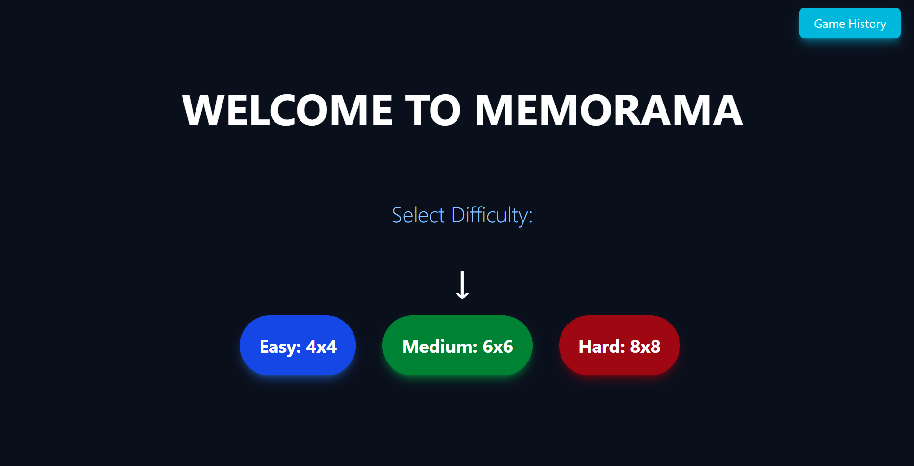
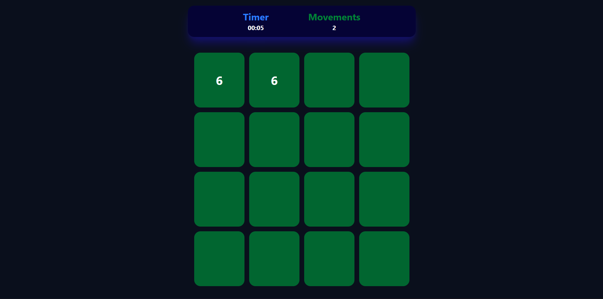

# 🧠 Memorama React

### 🏠 Pantalla de inicio



Un pequeño juego de memoria construido con **React**, **TailwindCSS** y **React Router**.  
Guarda tus mejores puntuaciones en el navegador usando `localStorage`.  
Proyecto enfocado en la práctica de hooks personalizados, diseño responsivo y gestión de estado local.

---

## 🚀 Tecnologías utilizadas

- ⚛️ **React** — interfaz de usuario declarativa y componetizada.
- 🎨 **TailwindCSS** — para un diseño moderno y adaptable.
- 🧭 **React Router DOM** — navegación entre vistas.
- 💾 **useLocalStorage Hook** — persistencia de datos en el navegador.
- ⚙️ **Vite** — entorno rápido de desarrollo y build tool moderna.

---

## 📸 Capturas

### 🎮 Juego en progreso



### 🏁 Historial de puntuaciones


## 📂 Estructura del proyecto

```bash
src/
 ├── Components/
 │   └── ModesMemorama/
 │       ├── BoardReutilityCode.jsx
 │       ├── HistoryBoard.jsx
 │       └── StartGame.jsx
 │
 ├── hooks/
 │   └── useLocalStorage.jsx       # Hook personalizado para guardar datos
 │
 ├── App.jsx                       # Enrutador principal
 ├── main.jsx                      # Punto de entrada
 ├── index.css                     # Configuración global de estilos
 └── ...


# 1️⃣ Clona este repositorio
git clone https://github.com/tuusuario/memorama.git

# 2️⃣ Entra al directorio
cd memorama

# 3️⃣ Instala dependencias
npm install

# 4️⃣ Ejecuta en modo desarrollo
npm run dev
```

# 💡 Características principales

🧩 Juego tipo Memorama con dificultad configurable.

💾 Guarda y persiste la mejor puntuación localmente (hook useLocalStorage).

🎨 Estilos modernos y adaptables con TailwindCSS.

🔄 Navegación fluida entre pantallas (React Router).

⚡ Rápido build con Vite.
